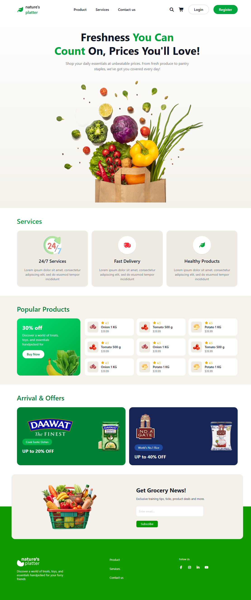

# 🥬 Nature's Platter

A fully responsive grocery e-commerce landing page built with **HTML5, Tailwind CSS, and Vanilla JavaScript** — featuring a responsive navbar, hero section, services, popular products, promotional offers, newsletter card, and footer.


---

## 🔗 Project Preview

**Live Demo:** [https://nature-s-platter-ph-s.vercel.app/](#) <!-- replace with your deployed link -->




---

## 📖 Overview

**Nature's Platter** is a grocery e-commerce landing page concept focused on clean visual hierarchy and responsive design — showcasing products, services, and offers in a layout that adapts smoothly from mobile to desktop.

---

## ✨ Features

**🧭 Navbar**
- Desktop menu (Product, Services, Contact Us) with Login/Register, search, and cart icons
- Mobile hamburger menu with JS-powered open/close, `bars` ↔ `xmark` icon swap
- Auto-closes on link click or resize to desktop

**🥕 Hero Section**
- Headline, description, and responsive banner image

**🚚 Services**
- 24/7 Support, Fast Delivery, and Healthy Products cards in a responsive grid

**🛒 Popular Products**
- Promotional discount card + product grid (image, name, rating, price)

**🎁 Arrivals & Offers**
- Featured product cards with discount badges, two-column on larger screens

**📧 Newsletter**
- Subscription card with email input and Subscribe button
- Floating overlap layout on `md+`, normal document flow on mobile to avoid overlap

**🦶 Footer**
- Logo, description, nav links, and social icons — center-aligned on mobile, left-aligned on desktop

---

## 🛠️ Tech Stack

| Technology         | Purpose                             |
|---------------------|--------------------------------------|
| HTML5               | Page structure and semantic markup  |
| Tailwind CSS v4     | Responsive styling and layout       |
| Font Awesome 7      | Navigation and social media icons   |
| Vanilla JavaScript  | Mobile navigation functionality     |

---

## 📁 Project Structure

```text
nature's-platter/
├── index.html
├── tailwind_init.css
├── assets/
│   ├── nav-logo.png
│   ├── footer-logo.png
│   ├── gate-logo.png
│   ├── dawat-logo.png
│   ├── Hero_Section_1.png
│   ├── Hero_Section-large.png
│   ├── Group_9181.png
│   ├── Mask_group.png
│   ├── grocery-basket.png
│   ├── delivery.png
│   ├── service.png
│   ├── popular.png
│   ├── products.png
│   ├── offers-1.png
│   ├── offers-2.png
│   ├── onion.png
│   ├── tomato.png
│   └── potato.png
└── README.md
```

---

## 🚀 Getting Started

No build tools or package installation required — this is a static site.

```bash
git clone <repository-url>
cd nature's-platter
open index.html   # or double-click the file
```

Tailwind CSS and Font Awesome load via CDN, so there's nothing else to install.

---

## 📱 Responsive Design

| Breakpoint | Width      | Behavior                                                          |
|------------|------------|--------------------------------------------------------------------|
| Mobile     | `< 768px`  | Stacked sections, mobile hamburger nav, newsletter card in normal document flow |
| `md`       | `≥ 768px`  | Two-column grids, floating/overlapping newsletter card             |
| `lg`       | `≥ 1024px` | Full desktop navbar, multi-column product grids                    |

---

## 🔧 Key Implementation Details

**Responsive Newsletter Layout**
The newsletter card floats with an overlap effect on `md+` screens. Below that, it sits in normal document flow — the fixed-offset overlap technique doesn't scale with the card's taller single-column mobile height, so switching to normal flow avoids it covering the hero section above or the footer links below.

**Mobile Navigation**
Handled with vanilla JavaScript: open/close toggle, hamburger-to-close-icon transition, `aria-expanded` accessibility state, auto-close on link click, and auto-close on resize to desktop width.

---

## 🎯 Project Goals

- Practice responsive design with Tailwind's utility classes
- Apply Flexbox and CSS Grid in real section layouts
- Build vanilla JavaScript DOM interactivity (mobile nav)
- Translate a static design concept into a working, responsive UI

---

## 📄 License

Open for personal and educational use.

---

## 👤 Author

**Aminul**
Programming Hero Student | Front-End Development Learner

This project was built as part of my journey to improve my front-end development skills.
